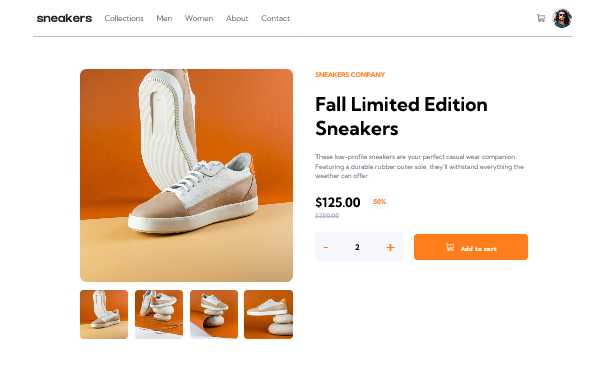
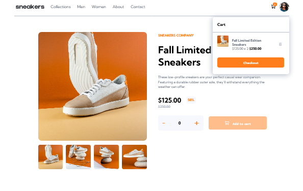
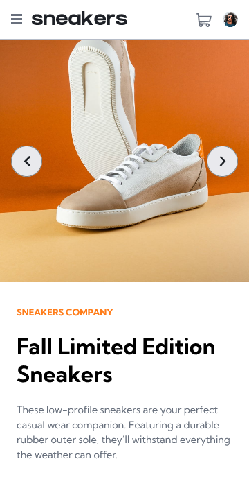
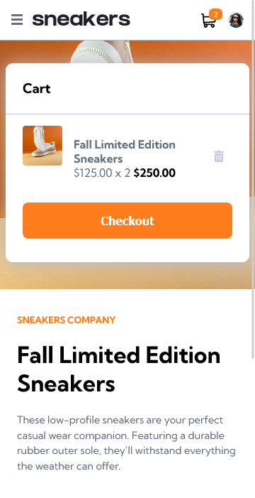

# Frontend Mentor - E-commerce product page

## Welcome! 👋

Thanks for checking out this front-end coding challenge.

[Frontend Mentor](https://www.frontendmentor.io) challenges help you improve your coding skills by building realistic projects.

### The challenge

In this challenge, you'll build a beautiful product page. We'll be putting your JS skills to the test with a lightbox product gallery and cart functionality!

### Screenshot

#### Desktop

#### Mobile

### Links

- [Github repo](https://github.com/edgarfb/ecomerce-product-page-main-)
- [Live Site URL](https://ecomerce-product-page-main-git-main-edgarfb.vercel.app/)

## My process

### Built with

- React
- Redux
- Styled Componets
- Mobile-first workflow
- Deploy on [vercel](https://vercel.com/)

### What I learned

It's been a long time from the last challenge, I have been learning new stuff and I tryed to apllyed all of that in this new challenge.
I continue working to get better with [React](https://reactjs.org/) and this time I used [Redux](https://redux.js.org/) to manage the app's state, I used Git and Github from the beginig to the end, also I have been explored the [Styled Component Library](https://styled-components.com/)(I really liked it).
My next move is it learn more about testing, like [Jest](https://jestjs.io/) and [Testing Library](https://testing-library.com/). See you the next time.

### Continued development

Next I want to explore more about:

- Jest
- Testing Library
- Nextjs.

### Useful resources

- [React](https://reactjs.org/)
- [create-react-app](https://create-react-app.dev/)

## Author

- [Website](https://www.edgarbritez.com/)
- [Github](https://github.com/edgarfb)
- [Frontend Mentor](https://www.frontendmentor.io/profile/edgarfb)
- [Twitter](https://www.twitter.com/edgarfb_ok)

## Acknowledgments

I really enjoined and I learned a lot about layout whith the content of [Kevin Powell](https://www.kevinpowell.co/).\
You guys can enroll on [this course](https://courses.kevinpowell.co/conquering-responsive-layouts) totaly free.
